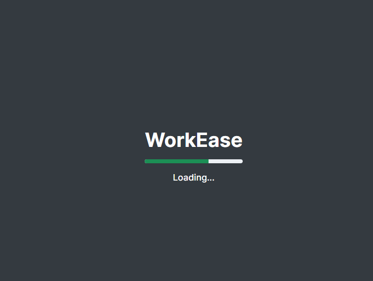
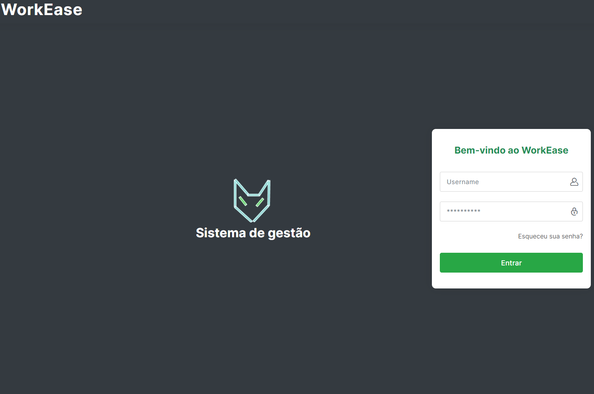
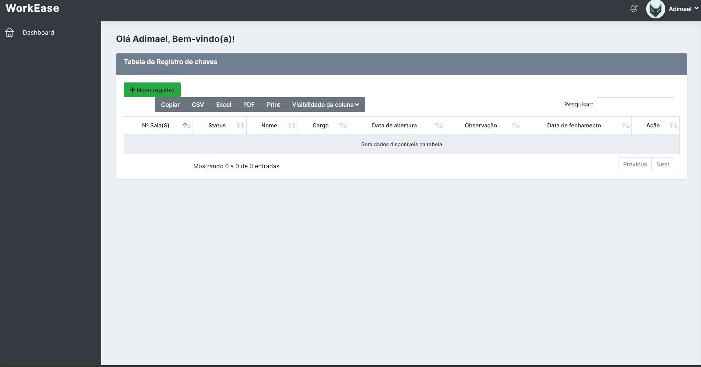

<h1 align="center">Sistema de gestão de Controle de chaves - PHP MVC com URL_AMIGAVEL v0.0.1</h1>

CRUD MVC (Versão 0.0.1)

 

Definição do projeto desenvolvido para estudo de programação web com PHP, usando como arquitetura de projeto o MVC, utilizando também URL amigável.

<h3>Descrição:</h3>
	
Aplicação CRUD completo para realizar o registro de chaves da portaria.

### Comandos:

- git clone https://github.com/adimael/registro_de_chaves_portaria.git

- composer update

- composer dump-autoload

- php -S localhost:8000

<h3>Tecnologias utilizadas:</h3>

#### FrontEnd

#### BackEnd

<h3 align="center">
Screenshots do projeto
</h3>

<footer>

Copyright © Scrybox.dev, 2024 by Adimael

</footer>
